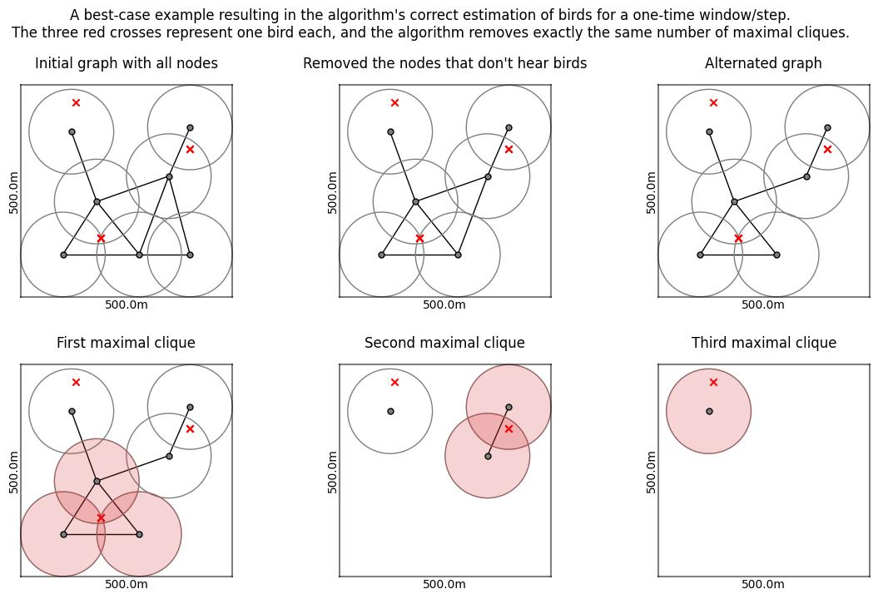

# Bird counting in Wireless Acoustic Sensor Networks (WASNs)

This repository contains a Python implementation of a bird counting algorithm for Wireless Acoustic Sensor Networks (WASNs). The implemented algorithm is based on "Algorithm 1", which is presented in a paper by Gros-desormeaux et al. [[1]](#1). Some changes were made to the algorithm to allow interaction with classification results as produced by the BirdNET (https://github.com/kahst/BirdNET) classifier.

# Algorithm

The following steps briefly describe the Algorithm implemented in this repository:
1. (Create the UDG) Create a Unit Disk Graph (UDG) of the underlying WASN, assuming that every node has the same hearing radius (unit disk) within which it can detect bird songs.
2. (Select the subgraph) For a one-time step, select a subgraph of the UDG containing all nodes which detected a bird within this time step.
3. (Alternate the subgraph) Ensure that the subgraph only contains cliques whose unit disks mutually intersect by removing the longest edge in every clique of size three whose unit disks don't intersect mutually.
4. (Count by removing the maximal cliques) Successively remove the maximal cliques from the subgraph until there are no nodes left. Count one bird for each maximal clique.
5. Repeat the process from step 2 for each species detected in this one-time step. Proceed to step 6 when all species are processed.
6. Repeat the process from step 2 for all time steps given. The result for each species is the maximum estimate obtained over all time steps for that species.

The following figure illustrates the procedure for a one-time step. The three red crosses represent one bird each, singing in that one-time step. The hearing radius for all nodes is 100.0 meters. This example results in the algorithm's correct estimation of birds since it removes exactly three maximal cliques.

## Implementation details

The implementations contained in this repository rely on the following Python libraries:
- NetworkX (https://networkx.org/): Used for generating, processing, and visualizing graphs and executing algorithms on them.
- Pandas (https://pandas.pydata.org/): Primarily used to handle the information needed by the algorithm in tables represented by DataFrames.
- NumPy (https://numpy.org/): Used mainly for randomized tasks.
- Matplotlib (https://matplotlib.org/): Used for visualizations and plots.

## Data handling

## One-time step/window

## Alternating the UDG

# References
<a id="1">[1]</a> H. Gros-desormeaux, P. Hunel, and N. Vidot, Wildlife Assessment Using Wireless Sensor Networks, Wireless Sensor Networks: Application - Centric Design, 2010.

