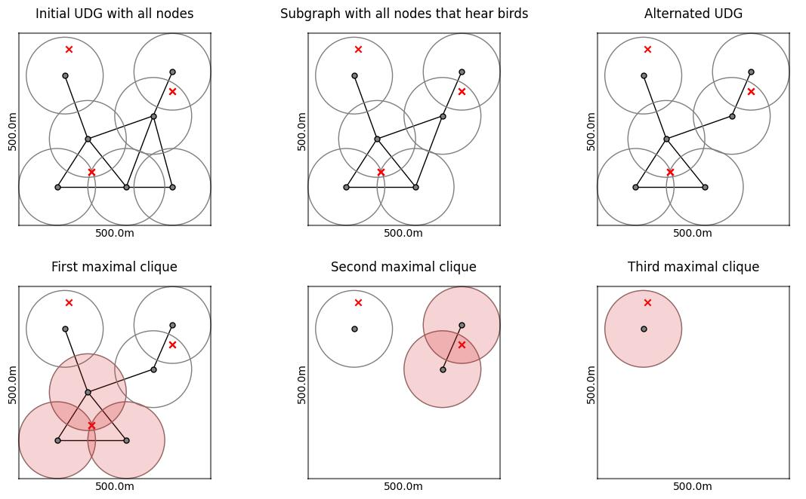

# Bird counting in Wireless Acoustic Sensor Networks (WASNs)

This repository contains a Python implementation of a bird counting algorithm for Wireless Acoustic Sensor Networks (WASNs). The implemented algorithm is based on "Algorithm 1", which is presented in a paper by Gros-desormeaux et al. [[1]](#1). Some changes were made to the algorithm to allow interaction with classification results produced by the BirdNET (https://github.com/kahst/BirdNET) classifier, aiming to make the usage of this algorithm on real WASNs possible.

# Algorithm

The following steps briefly describe the Algorithm implemented in this repository:
1. (Create the UDG) Create a Unit Disk Graph (UDG) of the underlying WASN, assuming that every node has the same hearing radius (unit disk) within which it can detect bird songs.
2. (Select the subgraph) For a one-time step, select a subgraph of the UDG containing all nodes which detected a bird within this time step.
3. (Alternate the subgraph) Ensure that the subgraph only contains cliques whose unit disks mutually intersect by removing the longest edge in every clique of size three whose unit disks don't intersect mutually.
4. (Count by removing the maximal cliques) Successively remove the maximal cliques from the subgraph until there are no nodes left. Count one bird for each maximal clique.
5. Repeat the process from step 2 for each species detected in this one-time step. Proceed to step 6 when all species are processed.
6. Repeat the process from step 2 for all time steps given. The result for each species is the maximum estimate obtained over all time steps for that species.

The following figure illustrates the procedure for a one-time step. The three red crosses represent one bird each, singing in that one-time step. The hearing radius for all nodes is 100.0 meters. This example results in the algorithm's correct estimation of birds since it removes exactly three maximal cliques.

# Implementation details

The implementations contained in this repository rely on the following Python libraries:
- NetworkX (https://networkx.org/): Used for generating, processing, and visualizing graphs and executing algorithms on them.
- Pandas (https://pandas.pydata.org/): Primarily used to handle the information needed by the algorithm in tables represented by DataFrames.
- NumPy (https://numpy.org/): Used mainly for randomized tasks.
- Matplotlib (https://matplotlib.org/): Used for visualizations and plots.

The functionalities are implemented in a package called "census". These include:
- Build the initial graph from a DataFrame containing the nodes' positions (either geo- or 2D coordinates). (see "census.utils.graphs")
- Construct the UDG depending on the hearing radius of the nodes. (see "census.utils.graphs")
- Alter the UDG so that the hearing radii mutally intersect within each clique. (see "census.utils.graphs")
- Estimate the amount of birds per species for a specific time interval, given the detections from a WASN in the form of BirdNET classification results. (see "census.utils.algorithms")
- Conditionally generate random graphs representing WASNs. Different patterns are available. (see "census.utils.random")
- Conditionally generate random data containing classification results for a given WASN. Specify a time period during which bird songs will be generated in the habitat monitored by the WASN. Additionally, specify which bird species, how many birds per species, and how often the birds sing within the habitat and time period. (see "census.utils.random")
- Visualize the graphs/WASNs, algorithms, birds, etc. (see "census.utils.visualize")

## Data handling

The following table shows a Pandas DataFrame generated by one of the random generation methods discussed later. The columns have the following meanings:

- node: Identifier of the node
- n_x: x-Position of the node
- n_y: y-Position of the node
- begin_time: Timestamp of the begin time of the BirdNET classification result
- end_time: Timestamp of the end time of the BirdNET classification result (usually 3 seconds later than begin_time)
- species_code: Species code as given by the BirdNET classifier
- b_x: x-Position of the bird (Only available in randomly generated data)
- b_y: y-Position of the bird (Only available in randomly generated data)
- true_count: True amount of birds of this species in the monitored habitat (Only available in randomly generated data)

The last three columns, "b_x", "b_y", and "true_count", would usually not be available in data recorded in real-life scenarios. These columns are included in randomly generated data for evaluation purposes of the algorithm (discussed later). The columns "node", "n_x", and "n_y" are needed to construct the initial graph. It is also possible to use geo coordinates instead of 2D coordinates. Then, the columns "n_x" and "n_y" should be replaced by the columns "lat" and "lon". Check out the documentation of the function "build_initial_graph" in "census.utils.graphs". The counting algorithm itself only needs the columns "node", "begin_time", "end_time", and "species_code".

|   node |      n_x |     n_y | begin_time                 | end_time                   | species_code   |       b_x |     b_y |   true_count |
|-------:|---------:|--------:|:---------------------------|:---------------------------|:---------------|----------:|--------:|-------------:|
|      3 | -10.1697 | 195.863 | 1970-01-01 00:00:11.267230 | 1970-01-01 00:00:14.267230 | blucha1        | -104.063  | 168.628 |            2 |
|      4 | 206.197  | 200.657 | 1970-01-01 00:00:11.425197 | 1970-01-01 00:00:14.425197 | comcha         |  166.892  | 274.83  |            2 |
|      4 | 206.197  | 200.657 | 1970-01-01 00:00:14.752811 | 1970-01-01 00:00:17.752811 | blucha1        |  186.39   | 221.631 |            2 |
|      2 | 103.368  | 109.134 | 1970-01-01 00:00:19.486614 | 1970-01-01 00:00:22.486614 | comcha         |   16.5272 | 110.164 |            2 |
|      3 | -10.1697 | 195.863 | 1970-01-01 00:00:19.486614 | 1970-01-01 00:00:22.486614 | comcha         |   16.5272 | 110.164 |            2 |

## One-time step/window

## Alternating the UDG

## Random graph generation

## Random data generation

# References
<a id="1">[1]</a> H. Gros-desormeaux, P. Hunel, and N. Vidot, Wildlife Assessment Using Wireless Sensor Networks, Wireless Sensor Networks: Application - Centric Design, 2010.

